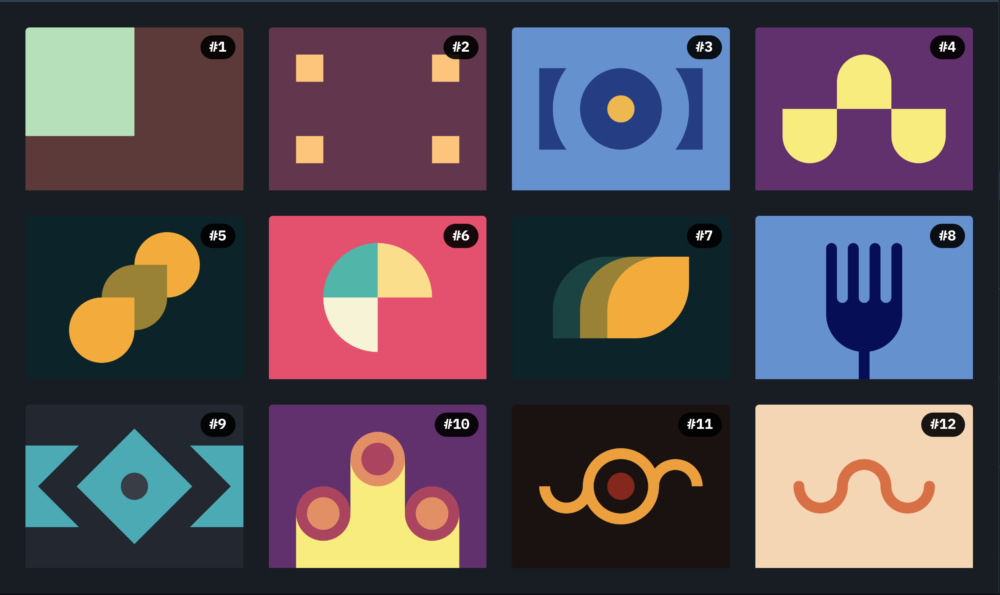
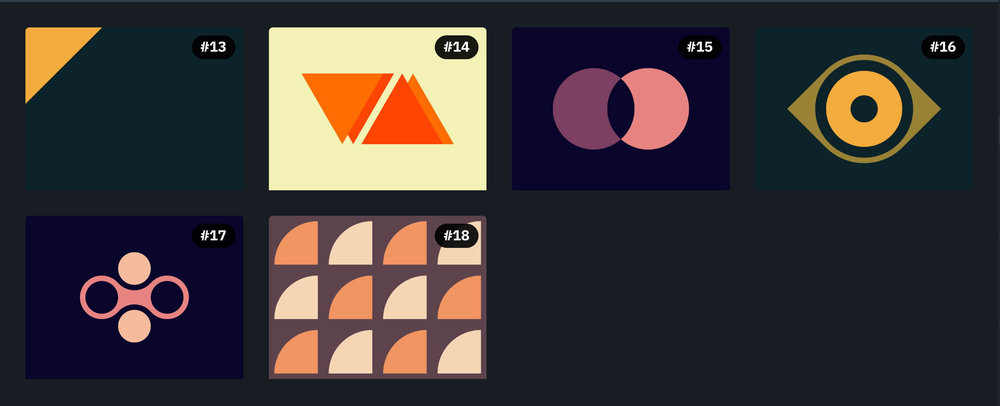

# CSS Battle

The goal of CSS Battle is to write the smallest CSS to _win the battle_.
Therefore, there are some **essential** [tips and tricks for CSS code-golfing](https://cssbattle.dev/tips) that can help to get better scores, so please have them in mind when interpreting my attempts, which I'll try to iterate over in each solution.

<!-- note: images generated by going to https://cssbattle.dev/battle/1 and hiding elements -->

## Battle 1 - Pilot Battle

- [#1 - Simply Square](./01-pilot-battle/01.md)
- [#2 - Carrom](./01-pilot-battle/02.md)
<!-- - [#3 - Push Button](./01-pilot-battle/03.md)
- [#4 - Ups n Downs](./01-pilot-battle/04.md) -->
- [#5 - Acid Rain](./01-pilot-battle/05.md)
<!-- - [#6 - Missing Slice](./01-pilot-battle/06.md) -->
- [#7 - Leafy Trail](./01-pilot-battle/07.md)
<!-- - [#8 - Forking Crazy](./01-pilot-battle/08.md) -->
- [#9 - Tesseract](./01-pilot-battle/09.md)
- [#10 - Cloaked Spirits](./01-pilot-battle/10.md)
- [#11 - Eye of Sauron](./01-pilot-battle/11.md)
- [#12 - Wiggly Moustache](./01-pilot-battle/12.md)

## Battle 2 - Visibility

- [#13 - Simple Square](./02-visibility/13.md)
<!-- - [#14 - Web Maker Logo](./02-visibility/14.md) -->
- [#15 - Overlap](./02-visibility/15.md)
<!-- - [#16 - Eye of The Tiger](./02-visibility/16.md)
- [#17 - Fidget Spinner](./02-visibility/17.md)
- [#18 - Matrix](./02-visibility/18.md) -->
